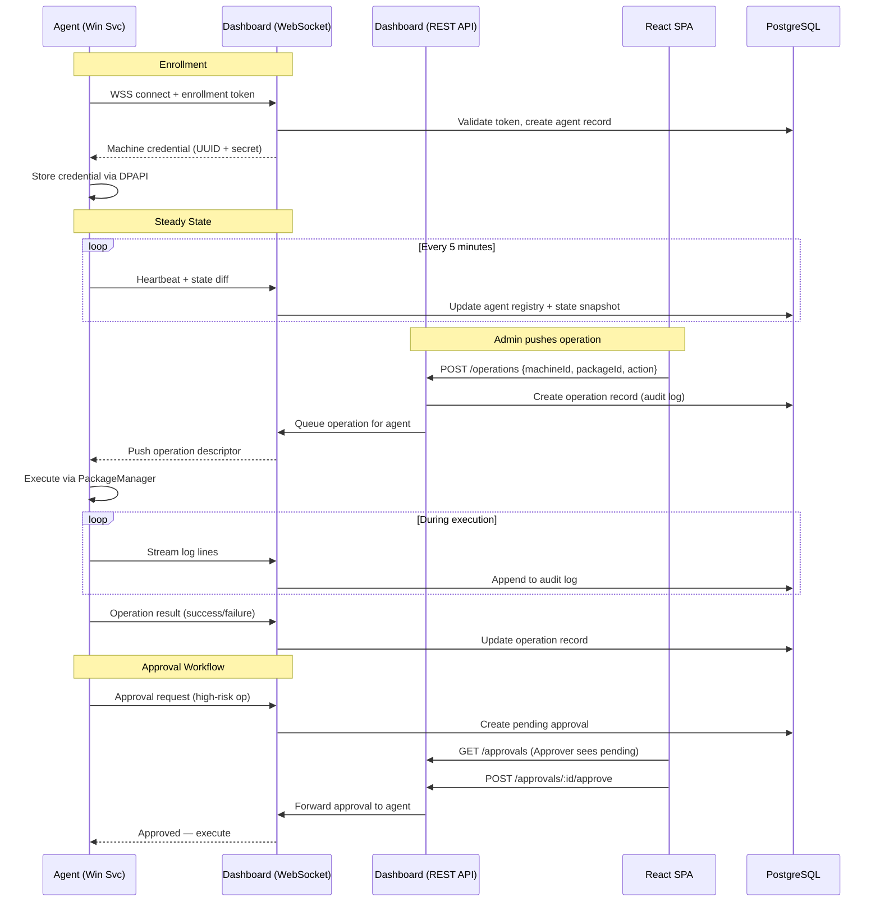

# feat: Agent+Dashboard Fleet Management Architecture

## Overview

Split UniGetUI into two products sharing the same PackageEngine libraries:

1. **UniGetUI Agent** — a headless C#/.NET 10 Windows Service that runs on each managed machine, exposes the existing PackageEngine over an expanded HTTP API, maintains a persistent WebSocket connection to the dashboard, and enforces centrally-defined policies
2. **UniGetUI Dashboard** — a new TypeScript web application (Fastify backend + React SPA frontend) deployed via Docker, providing fleet-wide visibility, remote operation push, RBAC, policy management, and audit logging

The existing WinUI desktop app continues unchanged for single-machine users.

## Problem Frame

Enterprise IT teams managing Windows fleets (10-100+ machines) have no centralized way to manage packages across machines, enforce security policies, or audit operations. UniGetUI's package engine is sound but locked inside a desktop GUI with no remote access. (see origin: `docs/brainstorms/2026-04-07-agent-dashboard-fleet-requirements.md`)

## Requirements Trace

All 34 requirements from the origin document (R1-R34) are addressed. Key groupings:

- **Agent core:** R1, R2, R3, R4, R5, R6, R8, R9, R31
- **Dashboard core:** R10, R11, R12, R13, R14, R15, R16, R17
- **Authorization:** R18, R19
- **Enrollment:** R20, R21, R22, R23
- **Security & policy:** R24, R25, R26, R27, R28, R29, R30
- **Protocol:** R7, R32, R33, R34 (R34 degraded mode: protocol infrastructure in Phase 3, behavioral implementation in Phase 5)

## Scope Boundaries

- Windows agents only (no macOS/Linux) — (see origin)
- WinGet CLI-only mode in agent (COM fails in Session 0) — (see origin)
- WinGet, Scoop, Chocolatey only — (see origin)
- Self-hosted Docker only (no SaaS) — (see origin)
- Tag-based machine groups only (no auto-assignment rules) — (see origin)
- No CVE correlation, no hash notarization ledger, no mobile app — (see origin)
- WinUI desktop app unchanged — continues for single-machine users — (see origin)
- Avalonia port paused — (see origin)

## Context & Research

### Relevant Code and Patterns

**Operations layer is cleaner than expected.** `AbstractOperation` and its subclasses (`AbstractProcessOperation`, `PackageOperation`, `InstallPackageOperation`, etc.) are GUI-free. They communicate entirely via events: `StatusChanged`, `LogLineAdded`, `OperationSucceeded`, `OperationFailed`. The GUI coupling is in the *registration layer*:
- WinUI: `src/UniGetUI/AppOperationHelper.cs` wraps operations in `OperationControl` (XAML)
- Avalonia: `src/UniGetUI.Avalonia/Infrastructure/AvaloniaOperationRegistry.cs` wraps operations in `OperationViewModel`

The agent needs only a headless equivalent of `AvaloniaOperationRegistry` that subscribes to operation events and reports them via WebSocket.

**Key files for agent reuse:**
- `src/UniGetUI.PackageEngine.PackageEngine/PEInterface.cs` — manager orchestrator, fully GUI-free
- `src/UniGetUI.PAckageEngine.Interfaces/IPackageManager.cs` — clean plugin contract
- `src/UniGetUI.PackageEngine.Operations/AbstractOperation.cs` — event-driven, no GUI deps
- `src/UniGetUI.PackageEngine.Operations/PackageOperations.cs` — uses singletons but no GUI widgets
- `src/UniGetUI.PackageEngine.Serializable/` — JSON-ready DTOs
- `src/UniGetUI.Interface.BackgroundApi/BackgroundApi.cs` — Kestrel on :7058, partially reusable
- `src/UniGetUI.Core.Data/CoreCredentialStore.cs` — Windows PasswordVault + file fallback
- `src/UniGetUI.Core.Settings/SettingsEngine.cs` — file-based settings, fully portable

**Thread-safety concern:** `AbstractOperation.OperationQueue` is a static `List<AbstractOperation>` (not thread-safe). Agent must wrap with `lock` or replace with `ConcurrentQueue<AbstractOperation>`.

**Translation passthrough:** `CoreTools.Translate()` returns the input string unchanged if no translation is loaded. The agent can skip loading translations — no code changes needed.

**Elevation in service context:** `PackageOperation.PrepareProcessStartInfo()` checks `CoreTools.IsAdministrator()` and skips elevation when already admin. A Windows Service running as LocalSystem is already admin — the elevator codepath is naturally bypassed.

**AutoUpdater:** Both WinUI and Avalonia versions are GUI-bound (Window/InfoBar/DispatcherQueue). The update *protocol* (fetch productinfo.json, compare versions, download, verify SHA-256 + Authenticode thumbprint) is extractable into a shared library. GUI orchestration (notifications, installer launch) must be replaced for the agent.

**Test infrastructure:** xUnit 2.9.3, 8 test projects covering Core libraries only. No tests for PackageOperations, BackgroundApi, PEInterface, or managers.

### External References

- **Dashboard stack:** Fastify + @fastify/websocket for backend, Vite + React SPA for frontend, Drizzle ORM for PostgreSQL, openid-client v6 for OIDC
- **Audit log:** PostgreSQL INSERT-only role + immutability trigger + monthly range partitioning
- **WebSocket auth for agents:** Agent secret in first message (not URL), JWT session upgrade, re-auth without reconnect

## Key Technical Decisions

- **WebSocket for agent-dashboard protocol:** Agent-initiated persistent outbound WSS connection. Simpler than gRPC (no protobuf compilation, no HTTP/2 requirement), bidirectional, works through enterprise proxies. The agent connects outbound; the dashboard never connects to agents. Heartbeat, state sync, operation push, log streaming, and policy sync all flow over this single connection. (Resolves deferred question affecting R6, R32)

- **Fastify + React SPA for dashboard:** Fastify handles both REST API (for web UI) and WebSocket connections (for agents). React SPA built with Vite, served as static files by nginx. No SSR needed — dashboard is behind auth. openid-client v6 for OIDC, Drizzle ORM for PostgreSQL. (Resolves deferred question affecting R10)

- **Agent reuses operations layer directly:** AbstractOperation is GUI-free. The agent creates a headless `AgentOperationRegistry` that subscribes to operation events and forwards them via WebSocket. No new operations pipeline needed — just a new registration layer (like AvaloniaOperationRegistry but simpler). (Resolves deferred question affecting R2)

- **OperationQueue thread-safety:** The existing static `List<AbstractOperation>` uses positional operations (`IndexOf`, `Insert`, `Remove`) incompatible with `ConcurrentQueue`. The agent's `AgentOperationQueue` uses a `lock`-guarded `List<AbstractOperation>` as a drop-in replacement. The WinUI/Avalonia apps continue using the existing unlocked list since they run on a UI thread. The agent never modifies the shared static field — it uses its own instance.

- **DPAPI for agent credential storage:** Windows DPAPI (via `System.Security.Cryptography.ProtectedData`) protects the machine credential at rest. Simpler than Windows Credential Manager and doesn't require WinRT APIs. Scoped to the service account. (Resolves deferred question affecting R21)

- **Protocol versioning:** WebSocket handshake includes a `X-Protocol-Version` header. Dashboard rejects agents with incompatible major versions. Minor version differences are tolerated with graceful degradation. (Resolves deferred question affecting R13)

- **RBAC via JWT claims:** Role encoded as a claim in the internal JWT. Fastify preHandler hook checks `requiredRole` per route. Four roles are simple enough that a plain enum comparison suffices — no policy engine needed. (see origin: R18, R19)

- **Separate DB user for audit:** A dedicated PostgreSQL role (`audit_writer`) with INSERT/SELECT only on audit tables. An immutability trigger blocks UPDATE/DELETE even from superusers. Monthly range partitioning by `logged_at`. (Resolves deferred question affecting R17)

## Open Questions

### Resolved During Planning

- **Protocol choice:** WebSocket — bidirectional, agent-initiated, works through proxies
- **Dashboard stack:** Fastify + React SPA (Vite) + Drizzle + PostgreSQL + openid-client v6
- **Operations layer scope:** Reuse existing AbstractOperation directly; build only a headless registry
- **Credential storage:** DPAPI
- **Version compatibility:** Protocol version header in WebSocket handshake
- **Audit table design:** INSERT-only role + trigger + monthly partitions

### Deferred to Implementation

- **Exact SQLite schema for agent operation log:** Needs iteration during implementation. Known columns: id, type, package_id, manager, version, options_json, status, started_at, completed_at, log_text, approval_status. Recovery of pending approvals by querying status='pending_approval' on startup
- **WinGet CLI-only behavior differences:** Some operations available via COM may not be available via CLI. Needs validation during agent testing with actual WinGet CLI
- **Nginx vs Traefik for TLS termination:** Either works; choose based on team familiarity during Docker Compose setup
- **Exact auto-update orchestration for Windows Service:** How to restart the service after update (self-replace binary, or external updater process). Needs experimentation

## High-Level Technical Design

> *This illustrates the intended approach and is directional guidance for review, not implementation specification. The implementing agent should treat it as context, not code to reproduce.*



## Implementation Units

### Phase 1: Agent Core

- [x] **Unit 1: Agent executable with Windows Service hosting**

  **Goal:** Create a new .NET 10 executable that runs as a Windows Service, initializes PEInterface with WinGet CLI-only mode, and starts a Kestrel HTTP API on a configurable port.

  **Requirements:** R1, R2 (partial), R31

  **Dependencies:** None

  **Files:**
  - Create: `src/UniGetUI.Agent/UniGetUI.Agent.csproj`
  - Create: `src/UniGetUI.Agent/Program.cs`
  - Create: `src/UniGetUI.Agent/AgentService.cs`
  - Create: `src/UniGetUI.Agent/AgentConfiguration.cs`
  - Modify: `src/UniGetUI.sln` (add new project)
  - Test: `src/UniGetUI.Agent.Tests/AgentServiceTests.cs`

  **Approach:**
  - Use `Microsoft.Extensions.Hosting.WindowsServices` for the Windows Service host
  - Reference all GUI-free PackageEngine projects (see research: "Recommended Agent Reference Graph")
  - Force WinGet to CLI-only mode by not referencing `WindowsPackageManager.Interop` and configuring the manager to use `BundledWinGetHelper` exclusively
  - Initialize `PEInterface.LoadLoaders()` first, then `PEInterface.LoadManagers()` at service start. **Ordering constraint:** `LoadLoaders()` must complete before any operation is accepted — the operation success handlers (`HandleSuccess()`) call `InstalledPackagesLoader.Instance.AddForeign()` which will NullRef if the singleton is not initialized. Start the HTTP listener only after both `LoadLoaders()` and `LoadManagers()` complete
  - Note: `PEInterface.csproj` pulls in all managers unconditionally on Windows (including npm, pip, Cargo, etc. beyond scope). Accept this for v1 — suppress out-of-scope managers at runtime via configuration rather than creating a separate project
  - Start Kestrel on configurable port (default: 7059, distinct from existing 7058) with loopback-only binding and token auth on all endpoints
  - Configure logging to exclude credential material (R31) — use structured logging with a sanitization filter
  - Skip translation loading — `CoreTools.Translate()` passes through strings unchanged

  **Patterns to follow:**
  - `src/UniGetUI.Avalonia/Program.cs` for minimal entry point
  - `src/UniGetUI.Interface.BackgroundApi/BackgroundApi.cs` for Kestrel setup pattern
  - `src/UniGetUI.PackageEngine.PackageEngine/PEInterface.cs` for manager initialization

  **Test scenarios:**
  - Happy path: AgentService starts, initializes PEInterface, and Kestrel responds to health check on loopback
  - Happy path: WinGet initializes in CLI-only mode (BundledWinGetHelper selected)
  - Edge case: Manager initialization timeout (60s) — service starts in degraded mode with available managers only
  - Error path: Kestrel port already in use — service logs error and fails gracefully
  - Integration: Health check endpoint returns agent version and available manager list

  **Verification:** Agent installs and starts as a Windows Service. `GET /health` returns 200 with agent metadata. PEInterface reports available managers.

---

- [x] **Unit 2: Headless operation registry + local SQLite log**

  **Goal:** Create an `AgentOperationRegistry` that subscribes to operation events, manages a thread-safe operation queue, persists operation logs to local SQLite, and supports recovery of pending operations after restart.

  **Requirements:** R2, R6 (local), R8

  **Dependencies:** Unit 1

  **Files:**
  - Create: `src/UniGetUI.Agent/Operations/AgentOperationRegistry.cs`
  - Create: `src/UniGetUI.Agent/Operations/OperationLogStore.cs`
  - Create: `src/UniGetUI.Agent/Operations/AgentOperationQueue.cs`
  - Test: `src/UniGetUI.Agent.Tests/Operations/AgentOperationRegistryTests.cs`
  - Test: `src/UniGetUI.Agent.Tests/Operations/OperationLogStoreTests.cs`

  **Approach:**
  - `AgentOperationRegistry` mirrors `AvaloniaOperationRegistry` but without UI binding: subscribes to `OperationSucceeded`, `OperationFailed`, `LogLineAdded`, `StatusChanged`
  - `AgentOperationQueue` wraps operation scheduling with a `lock`-guarded `List<AbstractOperation>` (the existing code uses positional operations like `IndexOf`, `Insert`, `Remove` that are incompatible with `ConcurrentQueue`). The agent creates its own instance rather than using the shared static field
  - `OperationLogStore` uses SQLite (via `Microsoft.Data.Sqlite`) with tables: `operations` (id, type, package_id, manager, version, options_json, status, initiated_by, started_at, completed_at) and `operation_logs` (operation_id, line_number, line_text, line_type, timestamp). The `status` column tracks the full lifecycle: `pending` → `running` → `completed`/`failed`/`pending_approval`/`cancelled`. Approval state is tracked as a `status` value, not a separate column
  - On startup, query `status IN ('pending', 'running', 'pending_approval')` to recover incomplete operations
  - Enforce 10 MB per-operation log cap with truncation (R6)
  - Sanitize ANSI escape sequences from log lines before storage

  **Patterns to follow:**
  - `src/UniGetUI.Avalonia/Infrastructure/AvaloniaOperationRegistry.cs` for event subscription pattern

  **Test scenarios:**
  - Happy path: Operation created, logs captured line by line, status transitions recorded in SQLite
  - Happy path: Operation completes successfully — status set to 'completed', all log lines persisted
  - Edge case: Operation exceeds 10 MB log limit — truncated with "[truncated]" marker
  - Edge case: ANSI escape sequences in log output — stripped before storage
  - Error path: Operation fails — status set to 'failed', failure reason recorded
  - Integration: Agent restarts with pending operation — recovered from SQLite and re-queued
  - Integration: Agent restarts with pending_approval operation — recovered and approval re-requested

  **Verification:** Operations execute headlessly, full logs are persisted in SQLite, and pending operations survive a service restart.

---

### Phase 2: Dashboard Core

- [x] **Unit 3: Dashboard server scaffold + PostgreSQL + Docker Compose**

  **Goal:** Create the dashboard project (Fastify + TypeScript), PostgreSQL schema (Drizzle migrations), and Docker Compose configuration for one-command deployment.

  **Requirements:** R10, R13, R17

  **Dependencies:** None (can run in parallel with Phase 1)

  **Files:**
  - Create: `dashboard/package.json`
  - Create: `dashboard/tsconfig.json`
  - Create: `dashboard/src/server.ts`
  - Create: `dashboard/src/db/schema.ts` (Drizzle schema)
  - Create: `dashboard/src/db/migrations/` (initial migration)
  - Create: `dashboard/docker-compose.yml`
  - Create: `dashboard/Dockerfile`
  - Create: `dashboard/nginx/nginx.conf`
  - Test: `dashboard/src/__tests__/server.test.ts`

  **Approach:**
  - Fastify with TypeScript, @fastify/websocket, @fastify/jwt, @fastify/cors
  - Drizzle ORM with PostgreSQL driver (`drizzle-orm/pg-core`)
  - PostgreSQL schema: `agents` (uuid, hostname, last_heartbeat, version, status, tags, enrolled_at), `audit_log` (id, agent_uuid, initiated_by, operation_type, package_id, manager, version, status, log_text, logged_at), `policies` (id, type, config_json, updated_by, updated_at), `users` (id, email, role, auth_provider, password_hash)
  - Audit table: separate `audit_writer` role with INSERT/SELECT only, immutability trigger, monthly range partitioning by `logged_at`
  - Docker Compose: postgres (with volume), fastify-server, nginx (TLS termination, serves React static files, proxies /api and /ws). nginx config must include WebSocket upgrade directives: `proxy_http_version 1.1`, `proxy_set_header Upgrade $http_upgrade`, `proxy_set_header Connection "upgrade"` — omitting these silently breaks all agent connections
  - TLS: ship with a self-signed certificate generator for development. Document that production deployments should use org-issued certificates and configure the agent to trust the org's CA (via `--trust-ca` flag or system certificate store)
  - Secrets via Docker secrets or env var references (never hardcoded)
  - Health check endpoint at `/api/health`

  **Technical design:**
  > *Directional guidance for the Docker Compose topology:*
  ```
  docker-compose.yml
  ├── postgres (port 5432, volume: pgdata)
  ├── dashboard-api (Fastify, port 3000, connects to postgres)
  └── nginx (ports 80/443, serves /static from Vite build,
  │         proxies /api -> dashboard-api:3000,
  │         upgrades /ws -> dashboard-api:3000)
  ```

  **Test scenarios:**
  - Happy path: `docker-compose up` starts all services, `/api/health` returns 200
  - Happy path: Drizzle migration creates all tables with correct constraints
  - Edge case: Audit table INSERT succeeds; UPDATE and DELETE are rejected by trigger
  - Error path: Dashboard starts without PostgreSQL — retries connection with backoff

  **Verification:** `docker-compose up` brings up dashboard. `/api/health` responds. Audit table rejects mutations.

---

- [x] **Unit 4: Dashboard authentication (OIDC + local fallback) + RBAC**

  **Goal:** Implement admin authentication via OIDC and local fallback, role-based access control with four roles, and no-self-approval enforcement.

  **Requirements:** R12, R18, R19

  **Dependencies:** Unit 3

  **Files:**
  - Create: `dashboard/src/auth/oidc.ts`
  - Create: `dashboard/src/auth/local.ts`
  - Create: `dashboard/src/auth/rbac.ts`
  - Create: `dashboard/src/auth/hooks.ts`
  - Modify: `dashboard/src/db/schema.ts` (users table)
  - Test: `dashboard/src/__tests__/auth.test.ts`

  **Approach:**
  - openid-client v6 for OIDC Authorization Code + PKCE flow (server-side)
  - After OIDC callback: issue internal JWT (15 min) + refresh token in HttpOnly cookie
  - Local auth: bcrypt password hash, same JWT issuance endpoint, rate limiting (5 attempts / 15 min per IP)
  - Setting to disable local auth once OIDC is configured
  - Roles encoded as JWT claim: `ReadOnly`, `Operator`, `Approver`, `SecurityAdmin`
  - Fastify preHandler hook checks `requiredRole` per route
  - R19 enforcement: `POST /approvals/:id/approve` rejects if `initiatedBy === currentUser`
  - First-run setup: create initial local admin account via CLI or env var

  **Test scenarios:**
  - Happy path: OIDC login flow completes, JWT issued with correct role claim
  - Happy path: Local admin login with valid credentials returns JWT
  - Edge case: Local auth disabled — login endpoint returns 403 with "OIDC required" message
  - Error path: Invalid credentials — returns 401, increments rate limit counter
  - Error path: Rate limit exceeded (6th attempt in 15 min) — returns 429
  - Integration: ReadOnly user cannot POST to /operations — returns 403
  - Integration: Approver cannot approve their own operation — returns 403 with "self-approval denied"

  **Verification:** Admin can log in via OIDC or local account. Routes enforce role requirements. Self-approval is rejected.

---

- [x] **Unit 5: Dashboard web UI (React SPA) + fleet view**

  **Goal:** Create the React SPA with fleet overview (machine list, package state, compliance status), machine detail view, and operation push UI.

  **Requirements:** R11, R14, R15, R16

  **Dependencies:** Unit 3, Unit 4

  **Files:**
  - Create: `dashboard/ui/package.json`
  - Create: `dashboard/ui/vite.config.ts`
  - Create: `dashboard/ui/src/App.tsx`
  - Create: `dashboard/ui/src/pages/FleetOverview.tsx`
  - Create: `dashboard/ui/src/pages/MachineDetail.tsx`
  - Create: `dashboard/ui/src/pages/Operations.tsx`
  - Create: `dashboard/ui/src/components/PackageTable.tsx`
  - Create: `dashboard/ui/src/components/OperationLog.tsx`
  - Create: `dashboard/ui/src/hooks/useWebSocket.ts`
  - Modify: `dashboard/nginx/nginx.conf` (serve UI static files)

  **Approach:**
  - Vite + React 19 + TypeScript
  - React Query for REST data fetching
  - WebSocket hook for real-time operation log streaming from dashboard API to browser
  - Fleet overview: table of machines with status indicators (online/offline/degraded), package count, pending update count, compliance badge
  - Machine detail: installed packages list, pending updates, operation history, tags
  - Operation push: select machines/groups → select action (install/upgrade/uninstall) → select package → confirm → stream logs
  - Machine groups: tag assignment UI, filter fleet view by tag
  - Built by Vite into static `dist/`, served by nginx container

  **Test scenarios:**
  - Happy path: Fleet overview renders machine list with correct status indicators
  - Happy path: Machine detail page shows installed packages and pending updates
  - Happy path: Admin pushes install operation to a machine group — operation appears in real-time log
  - Edge case: Machine goes offline — status updates to "offline" within one heartbeat interval
  - Edge case: Empty fleet (no enrolled agents) — shows onboarding instructions

  **Verification:** Admin can see fleet state, drill into machine details, and push operations from the browser.

---

### Phase 3: Agent-Dashboard Protocol

- [x] **Unit 6: Agent enrollment + credential storage**

  **Goal:** Implement the agent enrollment flow: generate tokens in dashboard, agent presents token via WebSocket, receives and stores machine credential via DPAPI.

  **Requirements:** R20, R21, R22, R23, R31

  **Dependencies:** Unit 1, Unit 3

  **Files:**
  - Create: `dashboard/src/enrollment/tokens.ts`
  - Create: `dashboard/src/enrollment/routes.ts`
  - Create: `src/UniGetUI.Agent/Enrollment/EnrollmentClient.cs`
  - Create: `src/UniGetUI.Agent/Enrollment/CredentialStore.cs`
  - Modify: `dashboard/src/db/schema.ts` (enrollment_tokens table)
  - Test: `dashboard/src/__tests__/enrollment.test.ts`
  - Test: `src/UniGetUI.Agent.Tests/Enrollment/EnrollmentClientTests.cs`

  **Approach:**
  - Dashboard: `POST /api/enrollment/tokens` generates a cryptographically random token, stores hash in DB with expiry (default 1 hour) and single-use flag. Rate limit: 10 enrollments per hour per source IP
  - Agent: configured with `--dashboard-url` and `--enrollment-token` CLI args. Connects via WSS, presents token in first message. Dashboard validates, consumes token, creates agent record, returns UUID + secret
  - Agent stores credential via `System.Security.Cryptography.ProtectedData` (DPAPI, `DataProtectionScope.LocalMachine`) in a file at `{CoreData.UniGetUIDataDirectory}/agent-credential.dpapi`
  - Agent never logs the enrollment token or machine secret (R31)
  - Dashboard detects concurrent credential use from different source IPs — flags in agent registry and optionally auto-revokes
  - Revocation (R23): dashboard marks agent as revoked; on next heartbeat the agent receives a revocation signal and ceases operations immediately

  **Patterns to follow:**
  - `src/UniGetUI.Core.Data/CoreCredentialStore.cs` for credential storage structure — but note the departure: `CoreCredentialStore` uses `Windows.Security.Credentials.PasswordVault` (WinRT, per-user). The agent uses `System.Security.Cryptography.ProtectedData` (DPAPI, per-machine) instead, which works in a Windows Service context without WinRT

  **Test scenarios:**
  - Happy path: Generate token → agent enrolls → appears in dashboard within one heartbeat
  - Happy path: Enrolled agent reconnects with stored credential — authenticated successfully
  - Edge case: Expired token (>1 hour old) — enrollment rejected with "token expired"
  - Edge case: Token used twice — second attempt rejected with "token already consumed"
  - Error path: Rate limit exceeded — returns 429
  - Error path: Invalid token — returns 401, logged in audit
  - Integration: Admin revokes agent — agent receives revocation on next heartbeat, stops operations
  - Integration: Same credential from two IPs — dashboard flags compromise alert

  **Verification:** Agent enrolls with one-time token, credential survives service restart, revocation takes effect within one heartbeat.

---

- [x] **Unit 7: WebSocket connection + heartbeat + state snapshots + policy sync**

  **Goal:** Implement the persistent WebSocket connection from agent to dashboard, heartbeat reporting, state snapshot diffs, and policy synchronization.

  **Requirements:** R4, R5, R7, R32, R33, R34

  **Dependencies:** Unit 2, Unit 6

  **Files:**
  - Create: `src/UniGetUI.Agent/Protocol/DashboardConnection.cs`
  - Create: `src/UniGetUI.Agent/Protocol/HeartbeatService.cs`
  - Create: `src/UniGetUI.Agent/Protocol/StateSnapshotService.cs`
  - Create: `src/UniGetUI.Agent/Protocol/PolicyEnforcer.cs`
  - Create: `dashboard/src/protocol/agentHandler.ts`
  - Create: `dashboard/src/protocol/messages.ts` (message type definitions)
  - Modify: `dashboard/src/db/schema.ts` (state_snapshots, policies tables)
  - Test: `src/UniGetUI.Agent.Tests/Protocol/DashboardConnectionTests.cs`
  - Test: `dashboard/src/__tests__/protocol.test.ts`

  **Approach:**
  - Agent: `DashboardConnection` manages WSS connection with auto-reconnect (exponential backoff: 1s, 2s, 4s, 8s, max 60s). Sends `X-Protocol-Version: 1` header on upgrade. Authenticates with machine credential in first message (not URL query string)
  - Heartbeat: every 5 min (configurable), sends `{ type: "heartbeat", agentId, version, managers: [...], timestamp }`
  - State snapshot: on first connect and every 6th heartbeat (30 min), send full snapshot. Otherwise send diff (packages added/removed since last snapshot). Uses `PEInterface.InstalledPackagesLoader` and `PEInterface.UpgradablePackagesLoader` data
  - Policy sync: dashboard pushes policy document on enrollment and on change. Agent stores locally with TTL (default: 1 hour). Policy includes: source_allowlist, package_blocklist, hash_skip_prohibition, pre_post_command_allowlist, approval_criteria
  - `PolicyEnforcer` intercepts operation creation and checks against local policy before execution
  - Degraded mode (R34): if policy TTL expires, agent refuses all new operations (logs reason). If WebSocket disconnects, agent queues state reports and replays on reconnect
  - Dashboard: `agentHandler.ts` manages per-agent WebSocket connections in a `Map<agentId, WebSocket>`, updates agent registry on heartbeat, stores state snapshots, pushes policy changes

  **Test scenarios:**
  - Happy path: Agent connects, authenticates, sends heartbeat — dashboard updates agent status to "online"
  - Happy path: Full state snapshot received — dashboard displays installed packages for machine
  - Happy path: Policy pushed to agent — agent enforces source allowlist on next operation
  - Edge case: WebSocket disconnects — agent reconnects with exponential backoff, replays queued state reports
  - Edge case: Policy TTL expires while disconnected — agent refuses new operations, logs "policy expired"
  - Edge case: Protocol version mismatch — dashboard rejects connection with "unsupported protocol version"
  - Error path: Dashboard unreachable for >TTL — agent enters degraded mode
  - Integration: Admin updates source allowlist in dashboard — change pushed to connected agents within seconds

  **Verification:** Agent maintains persistent connection, heartbeats appear in dashboard, state snapshots populate fleet view, policy changes propagate.

---

- [x] **Unit 8: Operation push + real-time log streaming**

  **Goal:** Enable the dashboard to push operations to agents and stream operation logs back to the web UI in real time.

  **Requirements:** R3, R6, R15

  **Dependencies:** Unit 2, Unit 7, Unit 5

  **Files:**
  - Create: `dashboard/src/operations/push.ts`
  - Create: `dashboard/src/operations/routes.ts`
  - Create: `dashboard/src/operations/logStream.ts`
  - Create: `src/UniGetUI.Agent/Protocol/OperationReceiver.cs`
  - Modify: `src/UniGetUI.Agent/Operations/AgentOperationRegistry.cs` (add WebSocket reporting)
  - Test: `dashboard/src/__tests__/operations.test.ts`
  - Test: `src/UniGetUI.Agent.Tests/Protocol/OperationReceiverTests.cs`

  **Approach:**
  - Dashboard: `POST /api/operations` accepts `{ agentId|groupTag, action, packageId, manager, options }`. Validates admin role (Operator+). Records in audit log. Sends operation descriptor via WebSocket to target agent(s)
  - For group operations: resolve tag to agent list, fan out operation to each connected agent
  - Agent: `OperationReceiver` deserializes operation descriptor, constructs `InstallPackageOperation`/`UpdatePackageOperation`/`UninstallPackageOperation` via the existing operation classes, passes to `AgentOperationRegistry`
  - Operation parameters built from manager's `OperationHelper.GetParameters()` — not raw CLI strings from dashboard (R3)
  - Log streaming: `AgentOperationRegistry` forwards `LogLineAdded` events via WebSocket as `{ type: "operation_log", operationId, line, lineType, timestamp }`. Dashboard stores in audit log and forwards to connected browser clients via a separate browser-facing WebSocket
  - Log sanitization: ANSI escape sequences stripped, 10 MB cap with truncation (R6)
  - Operation result: `OperationSucceeded`/`OperationFailed` sent as final message, updates audit log

  **Test scenarios:**
  - Happy path: Admin pushes install to one machine — agent executes, logs stream to dashboard, operation succeeds
  - Happy path: Admin pushes upgrade-all to a machine group (3 machines) — all three execute in parallel
  - Edge case: Agent disconnects during operation — operation continues locally, logs replayed on reconnect
  - Edge case: Operation produces >10 MB of output — truncated with marker
  - Error path: Package not found by manager — operation fails, error recorded in audit log
  - Integration: Admin watches real-time log in browser while agent executes an install

  **Verification:** Operations can be pushed from dashboard, execute on agents, and logs stream back in real time.

---

### Phase 4: Security & Policy

- [x] **Unit 9: Source allowlists + package blocklists + hash policy**

  **Goal:** Implement SecurityAdmin-managed policies (source trust, package blocklist, hash verification) that are enforced by agents.

  **Requirements:** R24, R25, R26

  **Dependencies:** Unit 7 (policy sync infrastructure)

  **Files:**
  - Create: `dashboard/src/policies/routes.ts`
  - Create: `dashboard/src/policies/types.ts`
  - Modify: `src/UniGetUI.Agent/Protocol/PolicyEnforcer.cs` (add enforcement logic)
  - Modify: `dashboard/ui/src/pages/Policies.tsx`
  - Test: `dashboard/src/__tests__/policies.test.ts`
  - Test: `src/UniGetUI.Agent.Tests/Protocol/PolicyEnforcerTests.cs`

  **Approach:**
  - Dashboard: CRUD routes for policies, restricted to SecurityAdmin role. Three policy types:
    - Source allowlist: per-manager list of approved source URLs. Agent disables unapproved sources
    - Package blocklist: list of `{managerId, packageId}` tuples. Agent rejects matching installs
    - Hash policy: boolean flag per machine group — prohibit `SkipHashCheck=true`
  - Policies pushed to agents via WebSocket on change (Unit 7 infrastructure)
  - `PolicyEnforcer` checks: before any operation, verify package is not blocklisted, source is allowlisted, and SkipHashCheck respects policy. Violations are hard failures logged to SQLite and reported to dashboard

  **Test scenarios:**
  - Happy path: SecurityAdmin adds a source to allowlist — agents receive updated policy
  - Happy path: Agent blocks install of a blocklisted package — returns error with policy reason
  - Edge case: Package from a source not in the allowlist — blocked with "source not approved"
  - Edge case: Operation with SkipHashCheck=true when hash policy prohibits it — blocked
  - Error path: SecurityAdmin with wrong role (Operator) tries to modify policy — 403
  - Integration: Blocklist updated → pushed to agents → agent rejects matching install within seconds

  **Verification:** Policies are manageable via dashboard, enforced by agents, and violations are logged.

---

- [x] **Unit 10: Approval workflow**

  **Goal:** Implement the approval workflow where high-risk operations are held until an Approver authorizes them, with no self-approval and persistence across restarts.

  **Requirements:** R27, R28, R19

  **Dependencies:** Unit 8, Unit 9

  **Files:**
  - Create: `dashboard/src/approvals/routes.ts`
  - Create: `dashboard/src/approvals/evaluator.ts`
  - Modify: `src/UniGetUI.Agent/Operations/AgentOperationRegistry.cs` (add approval hold)
  - Modify: `src/UniGetUI.Agent/Operations/OperationLogStore.cs` (add approval_status persistence)
  - Modify: `dashboard/ui/src/pages/Approvals.tsx`
  - Test: `dashboard/src/__tests__/approvals.test.ts`
  - Test: `src/UniGetUI.Agent.Tests/Operations/ApprovalWorkflowTests.cs`

  **Approach:**
  - `evaluator.ts`: checks operation against configurable criteria (defaults: elevated, non-allowlisted source, first-time package). Returns `requires_approval: true/false`
  - Agent side: if operation requires approval, set status to `pending_approval` in SQLite, send approval request via WebSocket, hold operation in queue
  - Dashboard: displays pending approvals. Approver can approve/deny. Server enforces `initiatedBy !== approverId` (R19). Approved → pushes approval to agent via WebSocket. Denied → notifies agent to cancel
  - Timeout: configurable window (default: 24 hours). Expired approvals auto-denied
  - Persistence: pending approvals survive agent restart (recovered from SQLite). Approval requests resent on WebSocket reconnect. Approved operations that aren't claimed within the expiry window are voided
  - Connectivity loss: operation stays queued, approval request resent on reconnect

  **Test scenarios:**
  - Happy path: Elevated install triggers approval → Approver approves → agent executes
  - Happy path: Approver denies → agent cancels operation, logs denial reason
  - Edge case: Approval times out (24h) — auto-denied, agent cancels
  - Edge case: Agent restarts with pending approval — recovered from SQLite, request resent
  - Edge case: Agent loses connectivity while waiting — operation stays queued, resent on reconnect
  - Error path: Operator tries to approve their own operation — 403 "self-approval denied"
  - Error path: ReadOnly user tries to approve — 403 "insufficient role"
  - Integration: End-to-end: push high-risk op → approval appears in dashboard → Approver approves → agent executes → logs stream back

  **Verification:** High-risk operations require approval, self-approval is blocked, approvals survive restarts and disconnects.

---

- [x] **Unit 11: Audit log + pre/post command allowlist + SIEM export**

  **Goal:** Complete the audit logging system with immutable storage, pre/post command policy enforcement, and CSV/JSON export for SIEM integration.

  **Requirements:** R29, R30, R17

  **Dependencies:** Unit 3 (audit table), Unit 8 (operation logging)

  **Files:**
  - Create: `dashboard/src/audit/routes.ts`
  - Create: `dashboard/src/audit/export.ts`
  - Create: `dashboard/src/policies/commandAllowlist.ts`
  - Modify: `src/UniGetUI.Agent/Protocol/PolicyEnforcer.cs` (add command allowlist enforcement)
  - Modify: `dashboard/ui/src/pages/AuditLog.tsx`
  - Test: `dashboard/src/__tests__/audit.test.ts`

  **Approach:**
  - Audit log: queryable via dashboard UI with filters (agent, date range, operation type, outcome). Pagination for large result sets
  - Pre/post command enforcement: `PolicyEnforcer` checks pre/post install commands against the command allowlist (exact string match). Default posture: deny (no commands execute until explicitly allowlisted). SecurityAdmin manages the allowlist
  - SIEM export: `GET /api/audit/export?format=csv|json&from=&to=` endpoint. Streams results to avoid loading entire audit log into memory. Operator+ role required
  - Immutability enforced by DB trigger (created in Unit 3). This unit adds the export UI and command policy

  **Test scenarios:**
  - Happy path: Audit log page displays operations with filters and pagination
  - Happy path: CSV export downloads filtered audit records
  - Happy path: Pre-install command on allowlist executes normally
  - Edge case: Pre-install command not on allowlist — blocked, logged to audit
  - Edge case: Empty allowlist (default) — all pre/post commands blocked
  - Error path: Large export (>100K records) — streams without OOM

  **Verification:** Audit log is queryable, exportable, immutable, and pre/post commands are policy-gated.

---

### Phase 5: Agent Lifecycle

- [x] **Unit 12: Agent self-update + degraded mode + machine groups**

  **Goal:** Implement headless agent self-update, degraded mode behavior, and tag-based machine groups in the dashboard.

  **Requirements:** R9, R16, R34

  **Dependencies:** Unit 7 (protocol), Unit 5 (dashboard UI)

  **Files:**
  - Create: `src/UniGetUI.Agent/Update/HeadlessAutoUpdater.cs`
  - Modify: `src/UniGetUI.Agent/Protocol/DashboardConnection.cs` (add degraded mode state machine)
  - Create: `dashboard/src/groups/routes.ts`
  - Modify: `dashboard/ui/src/pages/MachineGroups.tsx`
  - Modify: `dashboard/ui/src/pages/FleetOverview.tsx` (add group filter)
  - Test: `src/UniGetUI.Agent.Tests/Update/HeadlessAutoUpdaterTests.cs`
  - Test: `dashboard/src/__tests__/groups.test.ts`

  **Approach:**
  - **Self-update:** Extract update protocol from existing `AutoUpdater.cs` — fetch productinfo.json from dashboard-hosted URL, compare versions, download installer, verify SHA-256 hash + Authenticode signature against thumbprint pinned at enrollment. For service restart: agent downloads new binary to staging dir, validates, then uses `sc.exe` stop/start or a separate updater process to swap the binary. Dashboard notifies agent of available update via WebSocket
  - **Degraded mode:** State machine in `DashboardConnection`: `Connected` → `Disconnected` (within TTL, last policy valid) → `Degraded` (TTL expired, refuse all operations). Approval-gated operations are always queued when disconnected. State reports queued and replayed on reconnect
  - **Machine groups:** Tag-based: agents have a `tags: string[]` field. Dashboard UI for adding/removing tags on machines. Fleet view filterable by tag. Operations can target a tag (resolved to agent list at push time)

  **Test scenarios:**
  - Happy path: Dashboard publishes new agent version → agent downloads, verifies hash + signature, updates and restarts
  - Edge case: Update installer fails hash check — update rejected, agent continues on current version
  - Edge case: Update installer has wrong signer thumbprint — rejected
  - Happy path: Agent disconnects, reconnects within TTL — replays queued state, resumes normal operation
  - Edge case: Agent disconnects, TTL expires — enters degraded mode, refuses new operations
  - Happy path: Admin tags 3 machines with "finance" — group appears in fleet view, operations can target "finance"
  - Edge case: Tag removed from machine — machine no longer receives group-targeted operations

  **Verification:** Agent self-updates securely, degraded mode blocks operations after TTL, machine groups enable targeted operations.

## System-Wide Impact

- **Interaction graph:** Agent ↔ Dashboard WebSocket is the primary integration seam. All operation push, state sync, policy enforcement, and approval workflows flow through it. The dashboard REST API serves the React UI only. No direct agent-to-agent communication.
- **Error propagation:** Agent operation failures are reported via WebSocket → stored in PostgreSQL audit log → surfaced in dashboard UI. Network failures trigger local SQLite logging with replay on reconnect. Dashboard API errors return standard HTTP status codes to the React UI.
- **State lifecycle risks:** Partial state during enrollment (agent enrolled but first heartbeat not yet received), partial state during disconnection (dashboard view stale until reconnect + replay), approval state split between agent SQLite and dashboard PostgreSQL (must reconcile on reconnect).
- **API surface parity:** The agent's local HTTP API (loopback only) is separate from and simpler than the dashboard's REST API. They share the same `SerializablePackage` DTO format.
- **Integration coverage:** Unit tests alone cannot prove: enrollment → heartbeat → fleet view → operation push → log streaming → audit log. End-to-end integration tests with a real agent + dashboard instance are needed.
- **Unchanged invariants:** The existing WinUI desktop app, Avalonia port, and all PackageEngine libraries are unchanged. The agent references engine libraries but never modifies them. New code is additive.

## Risks & Dependencies

| Risk | Likelihood | Impact | Mitigation |
|------|-----------|--------|------------|
| WinGet CLI-only mode lacks features available via COM | Medium | Medium | Validate WinGet CLI feature parity during Unit 1; document any gaps |
| Windows Service restart during self-update drops in-flight operations | Medium | High | Drain operation queue before update; persist pending ops to SQLite |
| PostgreSQL audit table grows unbounded at fleet scale | Medium | Medium | Monthly partitioning + configurable retention policy (delete partitions older than N months) |
| WebSocket connections drop silently through corporate proxies | High | Medium | Heartbeat-based liveness detection (5 min); auto-reconnect with exponential backoff |
| OperationQueue thread-safety changes affect WinUI/Avalonia apps | Low | High | Agent uses its own AgentOperationQueue; do not modify the existing OperationQueue in shared code |
| OIDC provider misconfiguration blocks all admin access | Medium | High | Local admin fallback account always available unless explicitly disabled |

## Phased Delivery

### Phase 1: Agent Core (Units 1-2)
Foundation: headless Windows Service with operation execution and local SQLite logging. Delivers R1, R2, R6 (local), R8, R31. Independently testable without a dashboard.

### Phase 2: Dashboard Core (Units 3-5)
Foundation: Docker-deployed web app with auth, fleet view, and machine management. Delivers R10-R18. Independently testable with mock agent data.

### Phase 3: Agent-Dashboard Protocol (Units 6-8)
Integration: enrollment, persistent WebSocket, heartbeat, state sync, operation push, log streaming. Delivers R3-R5, R7, R20-R23, R32-R33, R34 (protocol infrastructure only — degraded mode behavior delivered in Phase 5). First end-to-end integration.

### Phase 4: Security & Policy (Units 9-11)
Enterprise features: source allowlists, blocklists, hash policy, approval workflow, audit log, SIEM export. Delivers R24-R30.

### Phase 5: Agent Lifecycle (Unit 12)
Operational maturity: self-update, degraded mode, machine groups. Delivers R9, R16, R34.

## Documentation / Operational Notes

- **Deployment guide:** Document Docker Compose setup, PostgreSQL initialization, OIDC configuration, agent installation, and enrollment flow
- **Agent installation:** MSI or exe installer that registers the Windows Service, prompts for dashboard URL + enrollment token
- **Monitoring:** Dashboard health check at `/api/health`. Agent health check at local loopback API. Agent offline detection via missed heartbeats (dashboard marks offline after 3 missed heartbeats = 15 min)
- **Backup:** PostgreSQL backup via standard `pg_dump`. Agent SQLite is local-only and recoverable from dashboard state

## Sources & References

- **Origin document:** [docs/brainstorms/2026-04-07-agent-dashboard-fleet-requirements.md](docs/brainstorms/2026-04-07-agent-dashboard-fleet-requirements.md)
- **Ideation:** [docs/ideation/2026-04-06-server-client-rewrite-ideation.md](docs/ideation/2026-04-06-server-client-rewrite-ideation.md)
- Related code: `src/UniGetUI.PackageEngine.Operations/AbstractOperation.cs`, `src/UniGetUI.Avalonia/Infrastructure/AvaloniaOperationRegistry.cs`, `src/UniGetUI.Interface.BackgroundApi/BackgroundApi.cs`
- External: Fastify WebSocket docs, Drizzle ORM docs, openid-client v6, PostgreSQL partitioning docs
